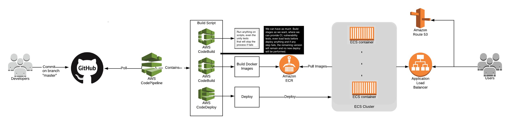
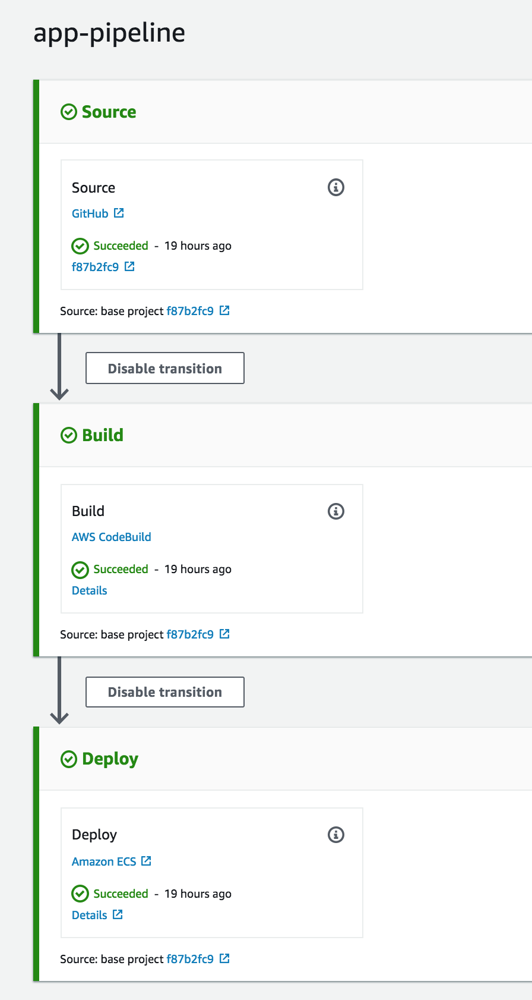
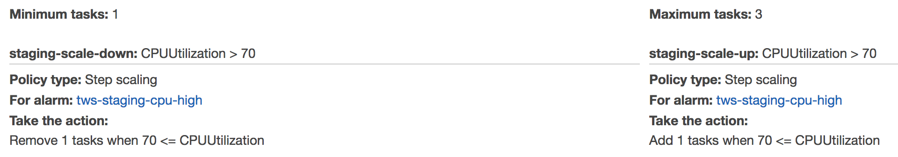

# ASI
Alius Simplex Infrastructure (another simple infrastructure)

The idea behind this repository is to describe how to create a basic reusable infrastructure to automatic deploy any containerized application whose source code is publicly available. The image will be built using **AWS Codebuild**, triggered on every commit to the master branch of the application's **GitHub** repository by **AWS Codedeploy**, then registered on **AWS ECR** and, finally, run as an **AWS ECS** cluster on **AWS Fargate**.

According to Amazon:

> CodeBuild is a fully managed continuous integration service that compiles source code, runs tests, and produces software packages that are ready to deploy.

> CodeDeploy is a fully managed deployment service that automates software deployments to a variety of compute services such as Amazon EC2, AWS Fargate, AWS Lambda, and your on-premises servers.

> ECR (Elastic Container Registry) is a fully-managed Docker container registry that makes it easy for developers to store, manage, and deploy Docker container images.

and, finally,

> AWS Fargate is a technology that you can use with Amazon ECS to run containers without having to manage servers or clusters of Amazon EC2 instances. With AWS Fargate, you no longer have to provision, configure, or scale clusters of virtual machines to run containers. This removes the need to choose server types, decide when to scale your clusters, or optimize cluster packing.

## TL;DR

### usage

- Create a github OAuth token and a AWS token, add whatever need to be fixed on [variables.tf](variables.tf);
- `terraform init`
- `terraform plan -var="github_token=YOUR-TOKEN-HERE"`
- `terraform apply -var="github_token=YOUR-TOKEN-HERE"`

Now, just wait and see the magic happens.

## IMPORTANT!!!

The master branch is suitable for terraform `0.12.*`. to uso terraform `0.11.*`, checkout the corresponding tag or branch.

## High level infrastructure design

## Components
- Fargate ECS cluster
  - Networking
    - VPC
    - subnets
    - routing tables
    - gateways
    - ALB
  - ECS
  - Auto Scaling
  - Hostname
  - security
- Continuous Delivery
  - CodeBuild
  - CodeDeploy
  - CodePipeline
- Acess Control
  - Endpoint whitelist

## Fargate ECS Cluster

### Networking

In order to achieve high availability, spawn the resources on more than one availability zone is the first thing to do to avoid some regions-specific failures so that the application will keep always running. Therefore, we create a VPC with, at least, 2 subnets (1 public and 1 private) in each *Availability Zone*.

Also, regarding the two subnets, is more than just best practices. In order to protect the infrastructure from unnecessary and unfiltered access, it's important to keep the cluster inside a _private subnet_ which allows traffic only from resources inside the _public subnet_, like the Application Load Balancer and a debug box, if we need it somehow.

An _ECS task_ on Fargate is integrated into a VPC, gets it’s own _Elastic Network Interface_(ENI), behaving like an EC2 instance, running in a single subnet, with a private ( and an optional public ) IP address and protected by a security group.

The creation of the VPC may be seen [here](modules/fargate/main.tf#L9-L17) and the creation of subnets [here](modules/fargate/main.tf#L19-L41)

To give the public subnet access to real world, we have to create a [NAT gateway](modules/fargate/main.tf#L59-L67) and an [internet Gateway](modules/fargate/main.tf#L43-L50), associate them with an [elastic IP](modules/fargate/main.tf#L53-L57) and create [routes](modules/fargate/main.tf#L69-L90) to everything work together.

The next step is to create the Application Load Balancer on the public subnet, forwarding the requests to the ECS service inside the private subnet. The ALB contains 3 parts, the [ALB per si](modules/fargate/main.tf#L100-L108), it's [target group](modules/fargate/main.tf#L110-L119) and it's [listener](modules/fargate/main.tf#L121-L129).

### Now, to define the ECS stuff.

First, configure the [cluster](modules/fargate/main.tf#L135-L137 ) then the [task definition](modules/fargate/main.tf#L139-L164), which is like a blueprint for the application and defines which Docker image will be used for containers, how many containers the task will require and resource allocation for each container. Now, the [ECS service](modules/fargate/main.tf#L166-L184 ) will create the service.

### Auto scaling

Fargate allows us to auto-scale our app with not much effort. Scaling up or down is easily triggered through some _CloudWatch metrics_, the only requirements are: create the scaling policies for both [up](modules/fargate/main.tf#L200-L215) and [down](modules/fargate/main.tf#L218-L233); and a [CloudWatch metric](modules/fargate/main.tf#L236-L251) based on some pattern like network or CPU. There are two stated, `alarm_action`, when, whatever the defined metric is passed, causing a scale up. And `OK`, which will scale down the running tasks/containers.

### Security

All [Roles](modules/fargate/main.tf#L301-L355) and [Security groups](modules/fargate/main.tf#L258-L296 ) are created to give the minimum amount of power and access to application.

### Subdomain
A simple **route53** entry to attach a new [subdomain](modules/ns/main.tf#L11-L17) connected to a previously allocated managed [domain](modules/ns/main.tf#L6-L8)

## Continuous Delivery

Before start to design the pipeline, a artifacts storage place is required. **AWS S3** is usually the way to go and don't require too much configuration to [setup](modules/buildndeploy/main.tf#L7-L14).

### CodeBuild

After a working infrastructure, build the docker image is the next step. For that, **AWS CodeBuild** is the way to go. First defining how to [build](modules/buildndeploy/main.tf#L23-L51) which will require a [file](modules/buildndeploy/appspec.yml) with all the build details. The build process will create the required artifacts and make them available.

### CodeDeploy

After definind the build, we have to handle the deployment. It's [straightforward](modules/buildndeploy/main.tf#L100-L115) to inform Codedeploy how to handle the deployment as we already have a target cluster setted and a build definition from CodeBuild.

#### CodePipeline

Once we have networking, a working cluster and a build step, is time to set up Continuous Delivery pipeline. CodeDeploy plays a great role here and it's [full pipeline description](modules/buildndeploy/main.tf#L59-L116) is very clear to read. It basically create all the required steps to apply a hook on a github repo/branch and [get code from there](modules/buildndeploy/main.tf#L66-L82). Then, invokes CodeBuild to [build everything](modules/buildndeploy/main.tf#L84-L98) and, finally, [deploy](modules/buildndeploy/main.tf#L100-L116) into ECS fargate cluster using CodeDeploy.

The whole process is fast executed by terraform but take some time to perform the safe deployment to the fargate cluster due to some internal security triggers.

A mentioned earlier, only 3 steps were used on this pipeline but other steps may be created using the same pattern to **add a CI** or any _code verification tool_.

The current self-generated pipeline may be seen below:

## Acess Control

### Endpoint whitelist

By using [AWS WAF](modules/waf/main.tf) is possible to isolate some endpoints for specific address defined on the [variables](variables.tf#L25-L33) file. It's, also, possible to add extra rule-based ACL on this systems.

## METRICS
Ater running the pipeline sometimes, I've got the following time:

- **Commit reaction reaction time:** `03 min` +-
- **Build total time:** `01:30` min+-
- **Deployment total time:** `05:30` min+-

In general, from a commit to master branch on any repository to a deployed and usable self-scalable cluster with roll-back capabilities, takes about 10 minutes without any human intervention.

